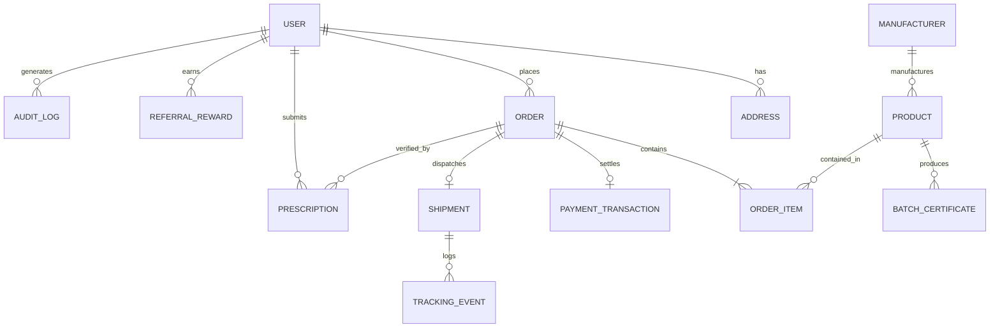

# IndoPharm — Database Architecture & Entity Specifications

**Version:** 1.0.0  
**Database Engine:** PostgreSQL 16+  
**Object-Relational Mapping (ORM):** Prisma Client  
**Design Patterns:** Strict Relational Integrity, Soft Deletes on ePHI, Append-Only Audit Trail  

---

## 1. High-Level Entity-Relationship (ER) Overview

---

## 2. Core Entities & Data Dictionary

### 2.1 User & Identity Management
- **`User`**: Primary platform actor (Patients, Pharmacists, Admins, Warehouse operators).
  - `id`: UUID (Primary Key)
  - `email`: VarChar(255) Unique, indexed
  - `passwordHash`: Text
  - `role`: Enum (`PATIENT`, `CLINICAL_PHARMACIST`, `OPS_WAREHOUSE`, `COMPLIANCE_ADMIN`, `SUPPORT_AGENT`)
  - `firstName`, `lastName`: VarChar(100)
  - `phone`: VarChar(25) (Encrypted at application level)
  - `dateOfBirth`: Date (Encrypted at application level)
  - `emailVerified`: Boolean (default false)
  - `twoFactorEnabled`: Boolean (default false)
  - `createdAt`, `updatedAt`: Timestamps

- **`Address`**: Physical shipping and billing addresses for U.S. patient orders.
  - `id`: UUID (Primary Key)
  - `userId`: UUID (Foreign Key -> User)
  - `type`: Enum (`SHIPPING`, `BILLING`)
  - `line1`, `line2`, `city`, `state`, `postalCode`: Text
  - `country`: VarChar(2) (Default 'US')
  - `isDefault`: Boolean

### 2.2 Sourcing, Catalog & Provenance
- **`Manufacturer`**: Validated Indian pharmaceutical manufacturing entity.
  - `id`: UUID (Primary Key)
  - `name`: VarChar(255) (e.g., "Cipla Ltd", "Sun Pharma", "Dr. Reddy's")
  - `cdscoLicenseNumber`: VarChar(100) Unique
  - `usFdaRegistrationNumber`: VarChar(100) (Nullable)
  - `facilityCity`, `facilityState`: VarChar(100) (e.g., "Ahmedabad", "Gujarat")
  - `whoGmpCertified`: Boolean
  - `verifiedAt`: Timestamp

- **`Product`**: Commercial medication listing (generic active pharmaceutical ingredient).
  - `id`: UUID (Primary Key)
  - `name`: VarChar(255) (e.g., "Atorvastatin Calcium")
  - `brandReferenceName`: VarChar(255) (e.g., "Generic for Lipitor")
  - `activeIngredient`: VarChar(255)
  - `strength`: VarChar(100) (e.g., "20mg")
  - `dosageForm`: VarChar(100) (e.g., "Oral Tablet")
  - `packageSize`: Integer (e.g., 90)
  - `ndcEquivalent`: VarChar(50) (U.S. NDC mapping for reference)
  - `fobPriceUsd`: Decimal(10,2) (Direct India factory cost)
  - `retailPriceUsd`: Decimal(10,2) (IndoPharm patient price)
  - `usAverageCashPrice`: Decimal(10,2) (U.S. retail benchmark for transparency)
  - `isControlledSubstance`: Boolean (default false; enforced strictly false)
  - `requiresPrescription`: Boolean (default true)
  - `manufacturerId`: UUID (Foreign Key -> Manufacturer)

- **`BatchCertificate`**: Verifiable laboratory Certificate of Analysis (CoA) tied to physical batch lot.
  - `id`: UUID (Primary Key)
  - `productId`: UUID (Foreign Key -> Product)
  - `lotNumber`: VarChar(100) Unique (e.g., "LOT-2026-AT20-941")
  - `manufactureDate`: Date
  - `expirationDate`: Date
  - `purityPercentage`: Decimal(5,2) (e.g., 99.85)
  - `coaDocumentUrl`: Text (Encrypted S3 bucket reference)
  - `releasedByQcOfficer`: VarChar(150)

### 2.3 Clinical Prescriptions
- **`Prescription`**: Digital prescription record uploaded by patient or transferred from physician.
  - `id`: UUID (Primary Key)
  - `userId`: UUID (Foreign Key -> User)
  - `prescriberName`: VarChar(255)
  - `prescriberNpi`: VarChar(10) (Encrypted at application level)
  - `prescriberState`: VarChar(2)
  - `documentUrl`: Text (Private encrypted bucket key)
  - `status`: Enum (`PENDING_REVIEW`, `UNDER_REVIEW`, `VERIFIED`, `REJECTED`, `EXPIRED`)
  - `verifiedByUserId`: UUID (Foreign Key -> User [Pharmacist])
  - `verificationNotes`: Text (Internal clinical documentation)
  - `expiresAt`: Date
  - `refillsAuthorized`: Integer
  - `refillsRemaining`: Integer

### 2.4 Orders, Payments & Logistics
- **`Order`**: Master purchase transaction.
  - `id`: UUID (Primary Key)
  - `orderNumber`: VarChar(30) Unique (e.g., "INDO-2026-89412")
  - `userId`: UUID (Foreign Key -> User)
  - `status`: Enum (`PENDING_PRESCRIPTION`, `UNDER_CLINICAL_REVIEW`, `CONFIRMED_PICKING`, `EXPORT_CUSTOMS`, `IN_TRANSIT_AIR`, `US_CUSTOMS_CLEARANCE`, `DOMESTIC_DELIVERY`, `DELIVERED`, `CANCELLED`, `REFUNDED`)
  - `subtotalUsd`, `shippingUsd`, `dispensingFeeUsd`, `totalUsd`: Decimal(10,2)
  - `shippingAddressId`: UUID (Foreign Key -> Address)
  - `createdAt`, `updatedAt`: Timestamps

- **`OrderItem`**: Specific medication lines within an order.
  - `id`: UUID (Primary Key)
  - `orderId`: UUID (Foreign Key -> Order)
  - `productId`: UUID (Foreign Key -> Product)
  - `batchCertificateId`: UUID (Foreign Key -> BatchCertificate, assigned at picking)
  - `quantity`: Integer
  - `unitPriceUsd`: Decimal(10,2)

- **`PaymentTransaction`**: Gateway-agnostic ledger record.
  - `id`: UUID (Primary Key)
  - `orderId`: UUID (Foreign Key -> Order) Unique
  - `providerId`: VarChar(50) (e.g., "mock-gateway", "acquirer-x")
  - `externalTransactionId`: VarChar(150)
  - `status`: Enum (`DRAFT`, `AUTHORIZED`, `CAPTURED`, `FAILED`, `REFUNDED`)
  - `amountUsd`: Decimal(10,2)
  - `authorizedAt`, `capturedAt`: Timestamps

- **`Shipment` & `TrackingEvent`**: Cross-border international transit milestone tracking.
  - `id`: UUID (Primary Key)
  - `orderId`: UUID (Foreign Key -> Order)
  - `carrier`: VarChar(50) (e.g., "DHL_EXPRESS", "FEDEX_CROSSBORDER", "USPS")
  - `trackingNumber`: VarChar(100)
  - `currentStage`: Enum (`INDIA_HUB`, `EXPORT_CUSTOMS`, `AIR_TRANSIT`, `US_PORT_OF_ENTRY`, `OUT_FOR_DELIVERY`, `DELIVERED`)
  - `events`: Relation to `TrackingEvent` records (timestamp, location, status description)

### 2.5 Security & Audit
- **`AuditLog`**: Immutable ledger of access and mutations on sensitive medical and transactional entities.
  - `id`: UUID (Primary Key)
  - `userId`: UUID (Nullable for anonymous actions)
  - `userRole`: VarChar(50)
  - `action`: VarChar(100)
  - `resourceType`: VarChar(50)
  - `resourceId`: VarChar(100)
  - `ipAddress`: VarChar(45)
  - `userAgent`: Text
  - `metadata`: JSONB
  - `timestamp`: Timestamp (Default now())
