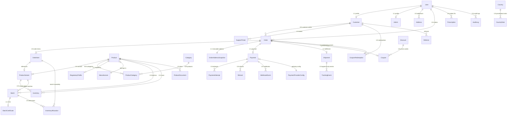

# IndoPharm — Database Architecture (Phase 16)
## PostgreSQL + Prisma: High-Integrity Cross-Border Pharmaceutical Commerce Database

**Document Classification:** Database Architecture & Data Governance Manual  
**Target Database:** PostgreSQL 16+ via Prisma ORM 7.10 (PrismaPg Driver Adapter)  
**Scope:** Complete Relational Schema, Models, Foreign Keys, Concurrency Controls, Snapshots, and Traceability  

---

## 1. Architecture Overview & High-Level Topology

IndoPharm operates as an international pharmaceutical commerce platform where transactions span cross-border trade, medical prescriptions, multi-currency settlements, batch-level quality certifications, and cold-chain logistics.

### Architectural Tiers

```
   ┌────────────────────────────────────────────────────────┐
   │             Customer Browser / Mobile Web              │
   └───────────────────────────┬────────────────────────────┘
                               │ HTTPS / JSON / Cookies
                               ▼
   ┌────────────────────────────────────────────────────────┐
   │             Next.js 16 App Router (Edge/Node)          │
   │  • Server Actions & API Route Handlers                 │
   │  • Zero Client Trust: Validates All Quantities & Money │
   └───────────────────────────┬────────────────────────────┘
                               │ Internal Service Call
                               ▼
   ┌────────────────────────────────────────────────────────┐
   │             Transactional Service Layer                │
   │  • InventoryService  • CouponService                   │
   │  • OrderPersistenceService  • PaymentService           │
   └───────────────────────────┬────────────────────────────┘
                               │ TypeScript Types / Queries
                               ▼
   ┌────────────────────────────────────────────────────────┐
   │          Prisma ORM 7.10 (PrismaPg Adapter)            │
   │  • pg.Pool Connection Pool                             │
   │  • Multi-statement Transactions ($transaction)         │
   └───────────────────────────┬────────────────────────────┘
                               │ PostgreSQL Wire Protocol (SSL)
                               ▼
   ┌────────────────────────────────────────────────────────┐
   │          PostgreSQL 16+ Primary Database               │
   │  • Normalized Relational Tables                        │
   │  • Foreign Key Integrity & Unique Constraints          │
   │  • Append-Only Audit & Tracking Logs                   │
   └────────────────────────────────────────────────────────┘
```

> [!CRITICAL]
> **Golden Boundary Rule**: The browser is never granted direct access to PostgreSQL or Prisma. All database operations flow strictly through the application service layer.

---

## 2. PostgreSQL Rationale

PostgreSQL 16+ was chosen over document/NoSQL databases (e.g. MongoDB) for the following non-negotiable enterprise requirements:

1. **Strict Referential Integrity**: Pharmaceutical commerce mandates foreign keys across Products, Batches, Orders, OrderItems, Shipments, and Customers. Deleting a product must never orphan past order records.
2. **ACID Transactions**: Order placement requires multi-entity atomic coordination: reserving inventory, applying coupons, writing address snapshots, and generating payment intents. If payment initialization fails, the entire transaction aborts cleanly.
3. **Concurrency Locking & Negative Stock Prevention**: PostgreSQL row-level locks (`SELECT FOR UPDATE` / atomic decrements) ensure that two simultaneous checkout requests for the final available medicine pack cannot result in negative stock (`stock = -1`).
4. **Audit Immutability**: Historical financial and compliance records must remain verifiable and append-only for pharmaceutical regulatory oversight (CDSCO, US FDA).

---

## 3. Entity Relationship (ER) Diagram



---

## 4. Comprehensive Model Descriptions & Cardinalities

### 4.1 User, Customer & Admin Separation
- **`User`** (`1:1` Customer, `1:1` Admin): Central authentication identity holding credentials, security flags (`twoFactorEnabled`, `emailVerified`), and primary role (`PATIENT`, `CLINICAL_PHARMACIST`, `OPS_WAREHOUSE`, `COMPLIANCE_ADMIN`, `SUPPORT_AGENT`, `ADMIN`, `SUPER_ADMIN`).
- **`Customer`** (`1:1` User): Dedicated customer entity holding commerce-specific data (`customerType`, `companyName`, `taxId`, `defaultCountryId`). Decoupled from staff/administrative profiles.
- **`Admin`** (`1:1` User): Internal administrative entity holding department (`CLINICAL`, `OPERATIONS`, `COMPLIANCE`, `FINANCE`, `SUPPORT`) and access privileges (`accessLevel`).

### 4.2 Sourcing, Multi-Variant Catalog & Provenance
- **`Product`**: Core pharmaceutical entity representing the medicine molecule/brand (e.g. *Atorvastatin Calcium*, *Metformin ER*), active ingredient, manufacturer, and base descriptions.
- **`ProductVariant`** (`1:N` from Product): Specific selling SKU (e.g., `SKU-INDO-AT20-90` = 20mg, 90 tablets, oral film-coated tablet). Holds pricing in integer minor units (`priceMinorUnits`).
- **`ProductCategory`** (`N:M` join table): Enables products to belong to multiple clinical categories (e.g. *Cardiovascular* and *Geriatric Health*).
- **`Manufacturer`**: Validated manufacturing facilities holding CDSCO licensing, US FDA registration, WHO-GMP certification, and origin geolocation.
- **`ProductDocument`**: Secure metadata for clinical documents (Certificate of Analysis, package inserts, manufacturing licenses) referencing private encrypted object storage keys with SHA-256 checksums.
- **`RegulatoryProfile`**: Structured cross-border regulatory metadata (personal importation whitelist eligibility under FDA CPG 110.300, Schedule H classification, 90-day maximum supply caps).

### 4.3 Inventory, Batches & Traceability
- **`Batch`**: Pharmaceutical lot tracking containing manufacturing date, expiration date, released quantity, and status (`RELEASED`, `QUARANTINED`, `RECALLED`, `DEPLETED`, `EXPIRED`).
- **`BatchCertificate`**: Encrypted COA (Certificate of Analysis) record issued by the verified Quality Assurance officer.
- **`Inventory`**: Location-aware stock ledger (`quantityOnHand`, `quantityReserved`, `quantityAvailable`, `reorderThreshold`).
- **`InventoryAllocation`**: Bridges `OrderItem` with the specific physical `Batch` dispensed, enabling complete forward and backward product recall traceability.

### 4.4 Orders & Historical Snapshot Immutability
- **`Order`**: Authoritative commercial transaction record containing server-calculated financials (`subtotalUsd`, `shippingUsd`, `dispensingFeeUsd`, `discountTotalUsd`, `totalUsd`).
- **`OrderItem`**: Contains immutable historical snapshots (`productNameSnapshot`, `skuSnapshot`, `manufacturerSnapshot`, `batchNumberSnapshot`, `unitPriceUsd`, `unitPriceMinorUnits`). If a product's price or description changes in the catalog tomorrow, historical order items remain identical to the moment of purchase.
- **`OrderAddressSnapshot`**: Immutable copy of shipping and billing names, addresses, and phone numbers captured at checkout. Customer profile updates never overwrite historical order addresses.

### 4.5 Payment Subsystem (Phase 15 Architecture Preserved)
- **`Payment`**: Provider-agnostic payment orchestrator record storing minor units (`amountMinorUnits`, `capturedMinorUnits`, `refundedMinorUnits`), state machine status (`InternalPaymentStatus`), and risk status.
- **`PaymentAttempt`**: Per-gateway attempt log for tracing multi-attempt 3DS/OTP authorizations.
- **`Refund`**: Enforced financial refund ledger guaranteeing that cumulative refunds never exceed captured amounts.
- **`WebhookEvent`**: Deduplicated event store with unique constraint `(provider, providerEventId)`.
- **`ReconciliationRecord`**: Flags discrepancies between internal ledger and gateway transactions.
- **`PaymentAuditEvent`**: Financial audit trail for payment lifecycle events.

### 4.6 Marketing & Customer Support
- **`Discount` & `Coupon`**: Configurable percentage or fixed discounts with start/end validity windows, global `usageLimit`, and per-customer limits.
- **`CouponRedemption`**: Atomic ledger recording coupon redemptions per order and customer.
- **`Referral` & `ReferralReward`**: Peer-to-peer referral incentives with anti-fraud rules (`referrer != referred`).
- **`SupportTicket`**: Customer service tickets linked to Customers and Orders.

---

## 5. Concurrency Controls & Critical Invariants

### 5.1 Preventing Overselling (Negative Inventory)
Inventory updates use atomic conditional operations:
```sql
UPDATE "Inventory"
SET "quantityReserved" = "quantityReserved" + :qty,
    "quantityAvailable" = "quantityAvailable" - :qty,
    "version" = "version" + 1
WHERE "id" = :id AND "quantityAvailable" >= :qty;
```
If two customers checkout simultaneously for the final pack in stock, exactly one update succeeds; the second receives an `InsufficientInventoryError`.

### 5.2 Preventing Coupon Over-Redemption
When a promotion has a limit of 100 uses, concurrent redemptions increment `usageCount` atomically within a transaction:
```sql
UPDATE "Coupon"
SET "usageCount" = "usageCount" + 1,
    "status" = CASE WHEN "usageCount" + 1 >= "usageLimit" THEN 'DEPLETED' ELSE "status" END
WHERE "id" = :id AND "usageCount" < "usageLimit";
```

### 5.3 Golden Rule of Refunds
In `Refund` processing, the cumulative refund check is enforced at the database service layer:
$$\text{amountRefundedMinorUnits} + \text{requestedRefundMinorUnits} \le \text{amountCapturedMinorUnits}$$

---

## 6. Indexing & Query Optimization Strategy

Indexes are created strategically to support high-frequency query paths without bloating write overhead:

| Table | Index Columns | Query Pattern Supported |
|---|---|---|
| `User` | `email`, `role`, `status` | Authentication, RBAC lookup |
| `Customer` | `userId`, `customerType` | Profile resolution, B2B/B2C filtering |
| `Product` | `slug`, `sku`, `name`, `brandReferenceName`, `activeIngredient`, `manufacturerId` | Catalog browsing, search, autocomplete |
| `ProductVariant` | `productId`, `sku`, `status` | Multi-SKU resolution, cart enrichment |
| `Batch` | `productId`, `productVariantId`, `expiryDate`, `status` | Expiry management, FIFO picking |
| `Inventory` | `productId`, `productVariantId`, `batchId`, `location` | Real-time stock checks, reservation |
| `Order` | `userId`, `customerId`, `orderNumber`, `status`, `createdAt` | Patient order history, admin fulfillment queues |
| `Payment` | `orderId`, `userId`, `status`, `providerPaymentId`, `paymentNumber` | Webhook correlation, settlement verification |
| `Shipment` | `orderId`, `trackingNumber`, `currentStage` | Logistics tracking, courier webhooks |
| `TrackingEvent` | `shipmentId`, `eventTime`, `stage` | Chronological milestone history |
| `Coupon` | `code`, `status` | Case-insensitive coupon validation |
| `AuditLog` | `userId`, `actorUserId`, `action`, `resourceType, resourceId`, `timestamp` | Compliance reporting, forensic investigation |

---

## 7. Security, ePHI Boundaries & Data Governance

1. **Zero Card Data in PostgreSQL**: No PAN, CVV, or cardholder PIN ever touches database tables.
2. **ePHI Protection**:
   - Prescriptions are accessed strictly under role-based least privilege (`CLINICAL_PHARMACIST`, `COMPLIANCE_ADMIN`, or the owning `PATIENT`).
   - Prescription files and Certificate of Analysis PDFs reside in private S3-compatible buckets; PostgreSQL stores only opaque encrypted storage keys and SHA-256 checksums.
3. **Application-Layer Encryption**: Sensitive personal identifiers (`phone`, `dateOfBirth`, `prescriberNpi`) are encrypted before database insertion.

---

## 8. Migration & Disaster Recovery Strategy

1. **Zero-Downtime Incremental Migrations**: Schema updates must be additive. Columns are added as nullable or with defaults before application code references them.
2. **Backups**:
   - Automated continuous WAL archiving (Point-in-Time Recovery - PITR).
   - Daily full logical snapshots with 30-day retention in an isolated geographical region.
3. **Recovery Objectives**:
   - **RPO (Recovery Point Objective)**: < 5 minutes via WAL streaming.
   - **RTO (Recovery Time Objective)**: < 30 minutes for database instance restoration.
