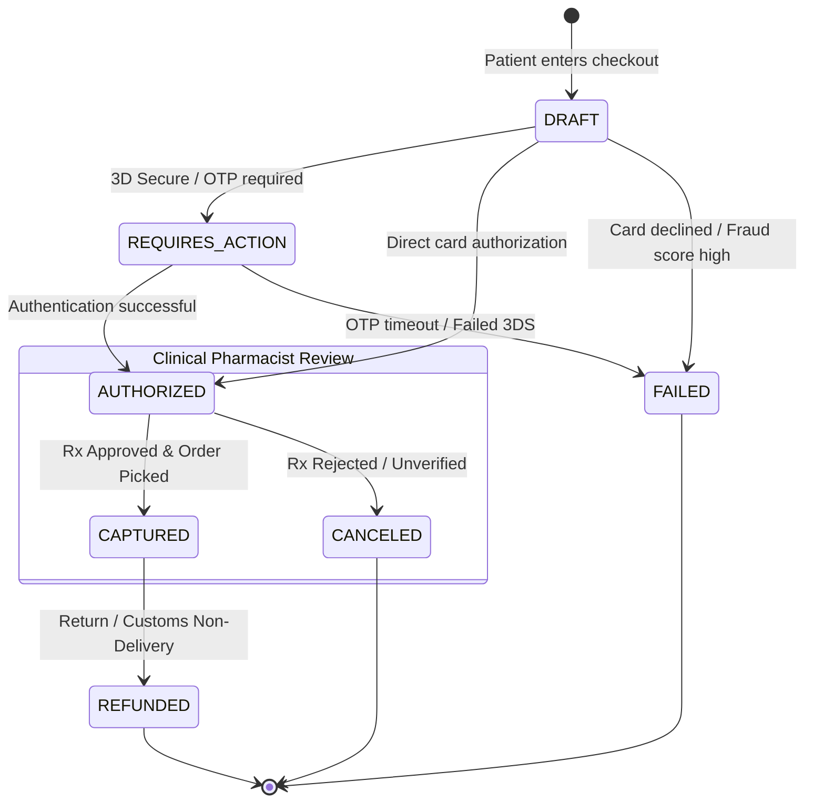

# IndoPharm — Gateway-Agnostic Payment Architecture

**Version:** 1.0.0  
**Design Philosophy:** Acquirer Agility, Zero Vendor Lock-in, Risk-Aware Settlement  
**Status:** Abstract Provider Specification (Active Implementation: Mock / Staging Provider)  

---

## 1. Architectural Rationale: Why Gateway-Agnostic?

Online pharmaceutical commerce is designated as **high-scrutiny / specialized category** (MCC 5122 - Drugs, Proprietaries, and Sundries / MCC 5912 - Drug Stores and Pharmacies) by global card brands (Visa, Mastercard, American Express).

Standard aggregators (e.g., standard domestic Stripe or PayPal accounts) frequently impose restrictive underwriting terms, sudden account holds, or categorical exclusions on cross-border generic medication shipments.

Therefore, IndoPharm is architected around a **strictly abstracted, provider-agnostic payment interface**:
- The application business logic never interacts directly with third-party SDKs.
- Switching or multi-homing across payment gateways (e.g., specialized healthcare merchant acquirers, international credit card gateways, or direct ACH/wire integrations) requires **zero changes** to cart, checkout, or order lifecycle code.
- Supports authorization-hold workflows where funds are authorized at checkout but captured only after pharmacist prescription verification and warehouse dispatch.

---

## 2. Core Abstraction Types & Interfaces

```typescript
/**
 * Standardized status of a payment intent throughout its lifecycle.
 */
export type PaymentStatus =
  | 'DRAFT'
  | 'REQUIRES_PAYMENT_METHOD'
  | 'REQUIRES_CONFIRMATION'
  | 'REQUIRES_ACTION'          // e.g., 3D Secure / OTP challenge
  | 'AUTHORIZED'               // Funds reserved, awaiting Rx approval
  | 'CAPTURED'                 // Funds settled to merchant
  | 'CANCELED'                 // Canceled before capture (e.g., Rx rejected)
  | 'REFUNDED'                 // Full or partial refund settled
  | 'FAILED';

/**
 * Standardized PaymentIntent representing a payment lifecycle object.
 */
export interface PaymentIntent {
  id: string;                          // Internal platform payment intent ID
  externalId: string | null;           // Gateway-specific transaction ID
  amount: number;                      // Amount in smallest currency unit (e.g., cents)
  currency: string;                    // ISO 4217 currency code (e.g., 'USD')
  status: PaymentStatus;
  orderId: string;
  customerId: string;
  clientSecret: string | null;         // Frontend token for client-side card/action execution
  paymentMethodType?: string;          // 'card' | 'ach' | 'wallet'
  capturedAmount: number;
  refundedAmount: number;
  errorMessage?: string | null;
  metadata: Record<string, string>;
  createdAt: Date;
  updatedAt: Date;
}

/**
 * Standardized Refund request and response representation.
 */
export interface RefundRequest {
  paymentIntentId: string;
  amount?: number;                     // Optional partial refund; if omitted, full refund
  reason: 'PRESCRIPTION_REJECTED' | 'CUSTOMER_CANCELLATION' | 'CUSTOMS_NON_DELIVERY' | 'SUSPECTED_FRAUD';
  note?: string;
}

export interface RefundResult {
  refundId: string;
  paymentIntentId: string;
  amount: number;
  currency: string;
  status: 'PENDING' | 'SUCCEEDED' | 'FAILED';
  createdAt: Date;
}

/**
 * Gateway Webhook Event payload envelope.
 */
export interface WebhookEvent {
  id: string;
  provider: string;
  type: string;                        // Standardized event: 'payment.authorized' | 'payment.captured' | 'payment.failed'
  payload: Record<string, unknown>;
  signature: string;
  timestamp: Date;
}

/**
 * Result of webhook cryptographic signature verification.
 */
export interface PaymentVerificationResult {
  isValid: boolean;
  event?: WebhookEvent;
  error?: string;
}
```

---

## 3. The `PaymentProvider` Contract

All payment gateways must implement this unified interface:

```typescript
export interface PaymentProvider {
  readonly providerId: string;

  /**
   * Initializes a payment intent for a given checkout order.
   */
  createPaymentIntent(params: {
    orderId: string;
    amount: number;
    currency: string;
    customerId: string;
    metadata?: Record<string, string>;
  }): Promise<PaymentIntent>;

  /**
   * Authorizes the payment without capturing funds.
   */
  authorizePayment(paymentIntentId: string, paymentMethodDetails?: unknown): Promise<PaymentIntent>;

  /**
   * Captures previously authorized funds upon prescription verification & dispatch.
   */
  capturePayment(paymentIntentId: string, amount?: number): Promise<PaymentIntent>;

  /**
   * Voids an authorization or cancels a pending intent.
   */
  cancelPaymentIntent(paymentIntentId: string, reason?: string): Promise<PaymentIntent>;

  /**
   * Executes a partial or complete refund.
   */
  processRefund(request: RefundRequest): Promise<RefundResult>;

  /**
   * Verifies incoming webhook request signatures from the gateway.
   */
  verifyWebhook(rawBody: string | Buffer, headers: Record<string, string>): Promise<PaymentVerificationResult>;
}
```

---

## 4. Payment Lifecycle State Machine



---

## 5. Security & PCI-DSS Scoping Rules

1. **Zero Raw Card Data Handling:** No primary account numbers (PAN), CVVs, or expiration dates ever touch IndoPharm servers. All payment fields are rendered in isolated client iframes or hosted fields provided by the active provider adapter.
2. **PCI-DSS SAQ A Scope:** Architecture remains strictly within the lowest PCI-DSS compliance scope (SAQ A) by ensuring all sensitive data capture is outsourced to compliant elements.
3. **Webhook Replay Protection & Idempotency:** Webhook handlers record processed event IDs in an idempotent ledger table (`PaymentAuditLog`). Duplicate delivery attempts are acknowledged with `200 OK` and discarded.
