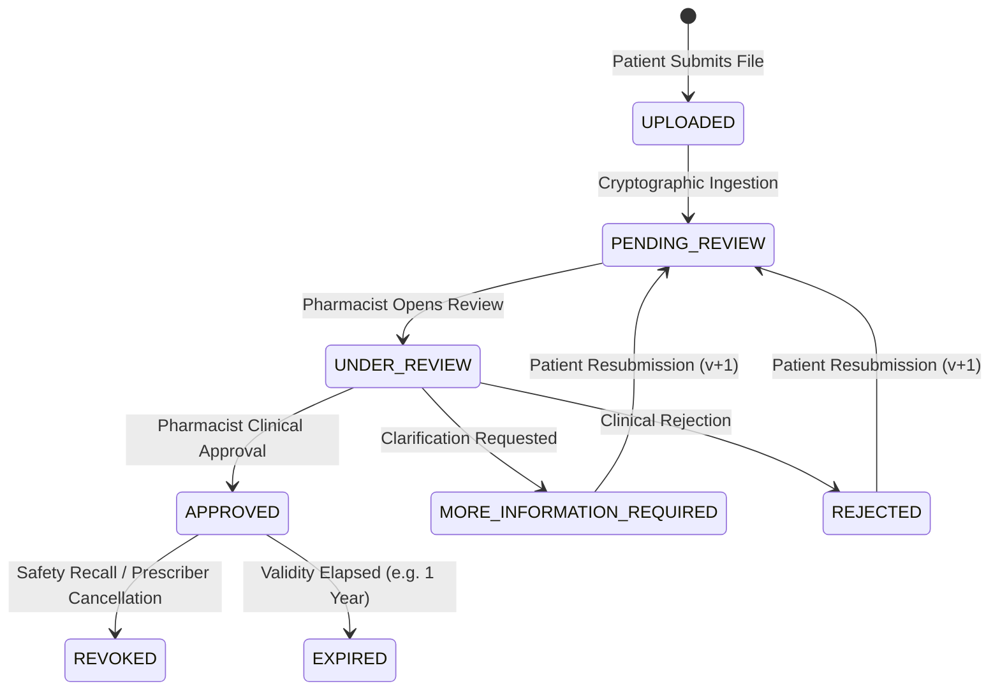

# INDOPHARM — PRESCRIPTION SYSTEM ARCHITECTURE (PHASE 19)

## 1. Executive Summary & Clinical Authority

IndoPharm operates as an enterprise cross-border pharmaceutical platform adhering strictly to **CDSCO (Central Drugs Standard Control Organisation, India)** and **US FDA 21 CFR § 1301.26 (Personal Importation)** compliance standards.

Under healthcare regulations:
- **Human Verification Authority**: Prescriptions for scheduled or regulated maintenance formulations MUST NEVER be auto-approved by AI, OCR, or heuristic algorithms. AI and OCR may assist with indexing, but clinical verification authority resides exclusively with licensed human clinical pharmacists (`CLINICAL_PHARMACIST` role).
- **Auditability**: Every approval, clarification request, rejection, and revocation must capture the reviewing pharmacist's user ID, timestamp, and clinical audit notes.

---

## 2. Private Storage & ePHI Security

Prescription files contain highly sensitive electronic Protected Health Information (ePHI).

### 2.1 Zero Public Bucket Exposure
- Prescriptions are stored in a private object store (`prescriptions/{customerId}/{uniqueStorageKey}`).
- Public read access is completely disabled. Direct HTTP requests to file paths return HTTP 403 Forbidden.

### 2.2 Short-Lived HMAC-SHA256 Signed URLs
- When an authorized patient or reviewing pharmacist needs to view a document, the server generates a cryptographically signed download URL:
  ```
  /api/documents/download?key=prescriptions/...&uid=...&exp=1789690000&sig=abcdef...
  ```
- **Validity Window**: Strictly 15 minutes (900 seconds).
- **HMAC Verification**: Uses server secret key (`STORAGE_SECRET_KEY` / `SESSION_SECRET`) over `storageKey|userId|expiresAt`.
- **Tamper Resistance**: Any alteration of the storage key, user ID, or expiry timestamp invalidates the signature and yields HTTP 403 Forbidden.

### 2.3 Cryptographic Integrity (SHA-256)
- Upon document ingestion, the server computes an immutable SHA-256 checksum of the raw file buffer (`documentHash`).
- This hash is persisted in the database record to detect any tampering or bit-rot over time.

---

## 3. Prescription Lifecycle State Machine



### 3.1 Allowed State Transitions
| Current Status | Allowed Next Statuses | Actor | Notes |
|---|---|---|---|
| `UPLOADED` | `UNDER_REVIEW`, `PENDING_REVIEW`, `REJECTED` | System / Pharmacist | Initial file ingestion |
| `PENDING_REVIEW` | `UNDER_REVIEW`, `VERIFIED`, `APPROVED`, `REJECTED`, `MORE_INFORMATION_REQUIRED` | Clinical Pharmacist | In clinical queue |
| `UNDER_REVIEW` | `APPROVED`, `VERIFIED`, `REJECTED`, `MORE_INFORMATION_REQUIRED` | Clinical Pharmacist | Pharmacist decision |
| `MORE_INFORMATION_REQUIRED` | `PENDING_REVIEW`, `UNDER_REVIEW`, `UPLOADED` | Patient | Patient uploads new scan |
| `APPROVED` / `VERIFIED` | `EXPIRED`, `REVOKED` | System / Pharmacist | Prescription active |
| `REJECTED` | `PENDING_REVIEW`, `UPLOADED` | Patient | Resubmission with v+1 |
| `REVOKED` | *None* | Pharmacist / Admin | Terminal state |

### 3.2 Versioning & Resubmission
- When a customer resubmits a prescription following a clarification request (`MORE_INFORMATION_REQUIRED`) or clinical rejection (`REJECTED`):
  1. The existing record's `version` counter increments (`v1` -> `v2`).
  2. The status resets to `PENDING_REVIEW`.
  3. New document hash and storage key are recorded.
  4. Previous clinical notes and audit entries are preserved in `AuditLog` to maintain legal chain of custody.

---

## 4. Insecure Direct Object Reference (IDOR) Defense

- Patients can ONLY access prescriptions belonging to their authenticated `userId` / `customerId`.
- Attempting to access another patient's prescription returns HTTP 403 Forbidden (`IDOR_REJECTED`).
- Roles authorized to access all prescriptions:
  - `CLINICAL_PHARMACIST`
  - `ADMIN`
  - `SUPER_ADMIN`
- Support agents and warehouse operators are blocked from viewing raw prescription documents under the Principle of Least Privilege.
