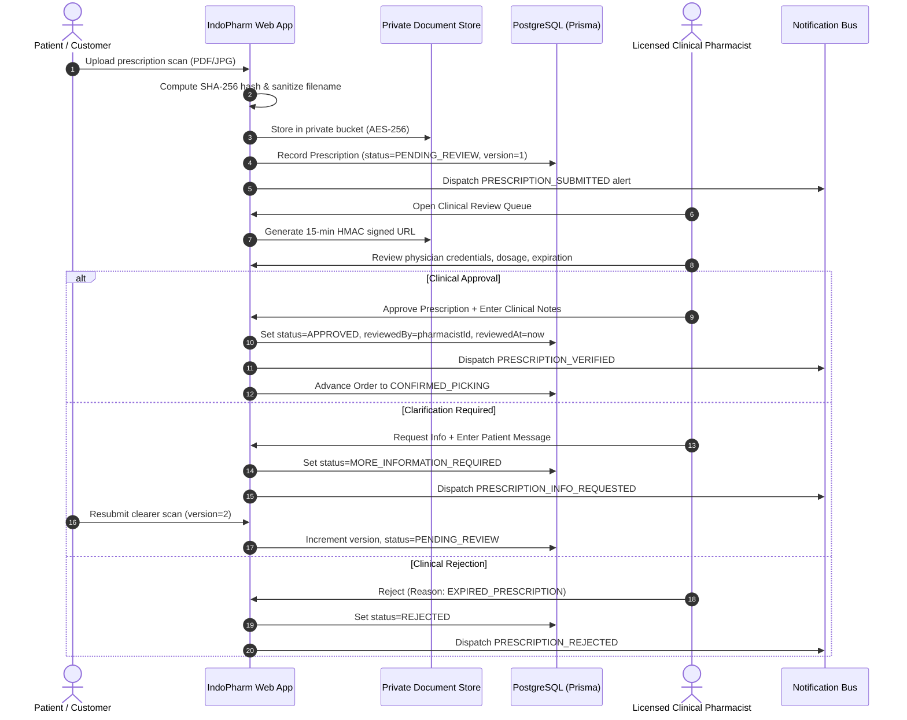

# INDOPHARM — CLINICAL PRESCRIPTION WORKFLOW SPECIFICATION

## 1. End-to-End Operational Lifecycle

## 2. Regulatory Compliance Summary

1. **CDSCO Drug Rules 1945**: Requires validation of Registered Medical Practitioner (RMP) credentials on all Schedule H/H1 drugs.
2. **FDA 21 CFR § 1301.26**: Restricts personal importation to a maximum 90-day supply for personal use only under valid doctor's care.
3. **HIPAA / ePHI Security**: Zero direct public access to document blobs; temporary signed URLs expire automatically after 15 minutes.
