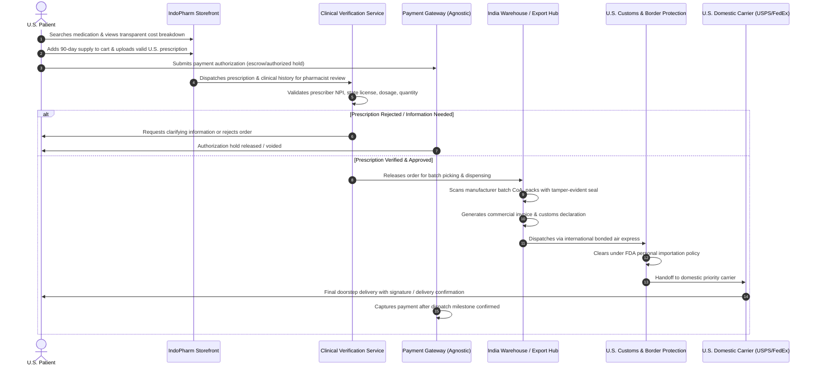

# IndoPharm — Product Specification

**Version:** 1.0.0  
**Status:** Approved for Foundation Architecture  
**Owner:** Product & Architecture Team  
**Scope:** India → USA Pharmaceutical Commerce Platform (Extensible to International Corridors)

---

## 1. Product Vision

IndoPharm is a cross-border pharmaceutical commerce platform connecting verified Indian pharmaceutical manufacturers with U.S. patients, payers, and commercial healthcare buyers. 

The platform is engineered around the realization that life-saving generic medications, chronic therapies, and specialty pharmaceuticals manufactured in India (which produces over 20% of the world's generic supply and 40% of U.S. generic prescriptions) often incur astronomical markup (800% to 3,000%) through domestic U.S. pharmacy benefit managers (PBMs), wholesalers, and retail intermediaries.

IndoPharm builds a transparent, verifiable, and compliant direct-to-consumer and business-to-business commerce bridge that prioritizes:
- **Radical Transparency:** Every batch's origin, Certificate of Analysis (CoA), and landed cost breakdown are visible.
- **Uncompromising Compliance:** Strict alignment with U.S. FDA Personal Importation guidelines, CDSCO export regulations, and state pharmacy oversight.
- **Consumer Trust & Frictionless Experience:** Simplifying prescription intake, clinical pharmacist verification, international cold-chain/tracked logistics, and proactive patient updates.
- **Institutional-Grade Security:** Strict protection of electronic Protected Health Information (ePHI) under HIPAA, robust encryption at rest and in transit, and immutable audit trails.

---

## 2. Target Users & Personas

### 2.1 Persona A: Chronic Maintenance Patient (Primary U.S. Consumer)
- **Profile:** 42–68 years old, managing chronic conditions (e.g., cardiovascular, diabetes, asthma, thyroid, neurological disorders) requiring daily generic medications.
- **Pain Point:** High deductibles, "donut hole" Medicare coverage, high out-of-pocket retail pharmacy copays, or lack of prescription insurance.
- **Needs:** Consistent 90-day supply delivery, transparent pricing, easy recurring refills, proof of manufacturer legitimacy, clear U.S. tracking.

### 2.2 Persona B: Uninsured / Underinsured High-Deductible Shopper
- **Profile:** Self-employed, gig-economy worker, or small business employee whose employer plan provides minimal prescription coverage.
- **Pain Point:** Paying full cash retail price ($200–$800/month) for brand or unbundled generic drugs.
- **Needs:** Clear comparative pricing (U.S. Cash vs. IndoPharm), straightforward prescription upload, fast customer support.

### 2.3 Persona C: Clinical Pharmacist & Compliance Officer (Internal Operator)
- **Profile:** Licensed U.S. and Indian pharmacist staff reviewing incoming patient prescriptions and dispensing orders.
- **Pain Point:** Fraudulent prescription submissions, dosage mismatches, drug-drug interaction risks, international regulatory compliance.
- **Needs:** Ergonomic prescription review queue, DEA/NPI validation tools, audit logging, direct communication channel to prescribing physicians and patients.

### 2.4 Persona D: Operations & Warehouse Fulfillment Manager (India & U.S. Logistics)
- **Profile:** Logistics lead overseeing batch intake from WHO-GMP/US-FDA approved Indian manufacturing sites, export dispatch, U.S. customs clearance, and last-mile carrier handoff.
- **Pain Point:** Lack of cross-border shipment visibility, customs inspection holds, cold-chain temperature deviations.
- **Needs:** Milestone-based tracking, automated customs declaration document generation, carrier API synchronization.

---

## 3. Primary Business Objectives

1. **Direct Manufacturer Sourcing:** Aggregate pharmaceutical supplies from validated WHO-GMP / US-FDA audited manufacturing plants across India.
2. **U.S. Compliant Market Structure:** Operate under legally vetted personal importation frameworks (FDA CPG 110.300 / 21 U.S.C. 381) and licensed dispensing partner entities.
3. **Transparent Landed-Cost Pricing:** Deliver 60%–85% cost savings on key generic maintenance medications while maintaining healthy gross margins (30%–45%).
4. **End-to-End Trust Architecture:** Eliminate counterfeit anxiety through batch verification, tamper-evident packaging, and verifiable manufacturer provenance.
5. **Seamless Prescription & Checkout Journey:** Minimize cart abandonment with zero-friction prescription submission, clear delivery timelines (10–14 business days), and upfront landed cost calculations.
6. **High Retention & Subscription Flywheel:** Automated refill reminders, 90-day auto-replenishment, and patient loyalty/referral programs.
7. **Operational Traceability:** Real-time milestone tracking across 8 distinct cross-border supply chain hops.
8. **International Multi-Corridor Scalability:** Architecture decoupled from country-specific assumptions, ready to enable India → UK, India → Canada, and India → EU corridors.

---

## 4. End-to-End Customer Journey

---

## 5. Major Feature Matrix

| Feature Domain | Core Capability | User Value |
| :--- | :--- | :--- |
| **Catalog & Transparency** | Active ingredient search, equivalent generic mapping, manufacturer provenance card, landed cost breakdown (Cost of Goods + Shipping + Dispensing Fee). | Eradicates confusion around generic equivalence; builds trust through open pricing. |
| **Prescription Intake** | Secure multi-format upload (PDF, JPG, HEIC), doctor lookup by NPI, transfer-from-pharmacy request workflow. | Low friction for non-technical patients; validates medical legitimacy upfront. |
| **Clinical Verification Queue** | Pharmacist dashboard for Rx scrutiny, patient identity verification, DEA schedule screening (strictly blocking controlled substances). | Protects patient safety and ensures zero tolerance for illicit or controlled medications. |
| **Agnostic Payment Processing**| Decoupled payment engine supporting authorized holds, multi-acquirer routing, localized billing, and automated refunds. | Shields platform from high-risk processor lock-in; ensures compliance with card brand rules. |
| **Cross-Border Milestone Tracker**| 8-stage tracking: Order Placed → Rx Approved → Picked in India → Export Customs → In Flight → U.S. Clearance → Domestic Transit → Delivered. | Overcomes international anxiety by providing proactive SMS/email notifications at every milestone. |
| **Refill & Adherence System**| 90-day cadence calculator, one-click refill requests, physician re-authorization pinging. | Drives recurring revenue and guarantees uninterrupted chronic patient care. |
| **Referral & Loyalty Engine** | Credit-based peer-to-peer referral links, transparent reward tracking, family member prescription grouping. | Reduces patient acquisition cost (CAC) through word-of-mouth trust. |

---

## 6. MVP Boundaries vs. Future Roadmap

### 6.1 In Scope for MVP (Phase 1–2)
- Catalog of top 50 high-demand, non-controlled, chronic maintenance generic medications (e.g., Metformin, Atorvastatin, Lisinopril, Levothyroxine, Amlodipine).
- Direct prescription upload & manual verification workflow for licensed pharmacists.
- Provider-agnostic payment abstraction with mock testing harness.
- Batch provenance card on product detail page displaying manufacturer plant location, US-FDA/WHO-GMP inspection reference, and CoA download.
- 8-stage visual milestone tracker for orders.
- Comprehensive disclaimers, clear regulatory notices, and complete transparency regarding delivery timelines (10–14 days).

### 6.2 Explicitly Out of Scope for MVP
- Controlled substances (Schedule II–V) — strictly forbidden on platform.
- Temperature-sensitive biologics or cold-chain insulin (deferred to Phase 4 dedicated logistics).
- Automated live PBM insurance claim adjudication.
- Telehealth prescribing within the platform (patients must present existing prescriptions from licensed U.S. providers).
- Same-day or next-day emergency acute delivery (IndoPharm is engineered for planned 90-day maintenance therapies).

---

## 7. Success Metrics & Key Performance Indicators (KPIs)

1. **Trust & Verification Rate:** >98% of orders fulfilled with full batch traceability and zero counterfeit claims.
2. **Prescription Approval SLA:** <4 hours for pharmacist review during business hours.
3. **Average Order Value (AOV):** Target $85–$140 (driven by 90-day and 180-day supply bundles).
4. **Repeat Purchase Rate (90-Day Retention):** >65% reorder rate within 85 days of initial delivery.
5. **Customer Delivery SLA:** 95% of shipments delivered within 10–14 calendar days from India dispatch.
6. **Regulatory Compliance Score:** 100% adherence to zero-controlled-substances policy and FDA personal import quantity limits (max 90-day supply).
